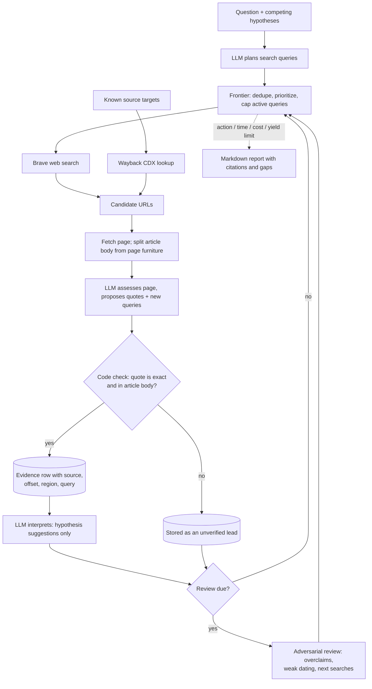

[](https://github.com/nathancurry/hypertrace/actions/workflows/test.yml)

# Hypertrace

A research harness where an LLM proposes searches and reads sources, but code decides what counts as evidence.

Hypertrace runs bounded web research on historical questions, such as where a term first appeared. The model plans searches, reads fetched pages, and suggests interpretations. Every source, exact quote, and model call is stored in SQLite, so any claim in the final report can be traced back to the page text it came from. It is built for questions where a fluent but wrong answer is worse than "inconclusive".

## How a run works



## The interesting parts

- **Code enforces provenance.** A model-proposed quote becomes evidence only if it appears verbatim in the fetched article body. Quotes from navigation, sidebars, or search snippets are kept as leads instead. Page publication dates never date a quote. Model interpretations are stored as suggestions and never change a hypothesis's status.
- **Adversarial review on a schedule.** A separate review model challenges the stored record: overclaims, weak dating, repeated secondary claims. It can retire exhausted search avenues and add up to 3 high-value queries. Review runs after 25 meaningful actions, or earlier when important new evidence arrives. A failed review stops the run and stays due for the next run.
- **Cost accounting per provider attempt.** Every HTTP attempt is logged with provider, role, retry reason, and token usage. Cost is split into provider-reported, locally estimated, and unknown. Before each call, the worst-case cost (all retries, a schema-repair call, and fallback) is reserved against `--max-cost`.
- **Rate-limit failover for review.** After two HTTP 429s from the primary review provider, the call moves to a configured fallback provider. `Retry-After` headers are honored. Diagnostics are stored without prompts, response text, or API keys.
- **Resumable, crash-safe state.** Multi-record state changes are written in single SQLite transactions. A file lock allows one run per question. Failed fetches and searches are kept with retry times, so the next run picks up where the last one stopped.

## Stack

Python 3.13, SQLite, httpx, Pydantic, any OpenAI-compatible chat API, Brave Search API, Internet Archive CDX; pytest and uv.

## Running it

```sh
uv sync --extra dev
uv run pytest                      # 149 tests, no API keys or network needed
uv run hypertrace init             # seeds the example question (origin of "hyperpop")
export BRAVE_SEARCH_API_KEY=... LLM_BASE_URL=... LLM_API_KEY=... RESEARCH_MODEL=...
uv run hypertrace run --max-actions 30 --max-minutes 20
uv run hypertrace report --output report.md
```

Full configuration, review and failover settings, and evidence rules are in [docs/install.md](docs/install.md).

## Status

Working prototype, run from the command line. The repo ships with one example question.
